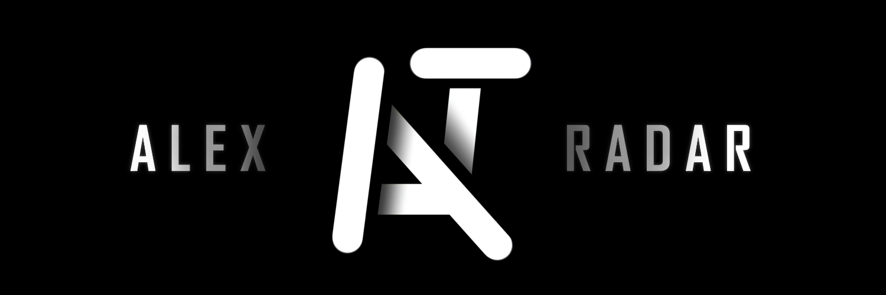

  

# AlexRadar

**Intelligent Code Analysis and Generation Platform**

AlexRadar is a sophisticated software solution that bridges the gap between human intent and machine‑generated code. It unifies advanced natural language processing, optical character recognition, and adaptive model selection into a single, powerful tool designed for developers, researchers, and technical teams.

At its core, AlexRadar automatically identifies the programming language of a given request, extracts content from a wide array of file formats—including images and documents—and then generates context‑aware, production‑ready code using best‑in‑class local or cloud‑based language models.

---

## Key Capabilities

### Programming Language Detection
- Supports over 25 programming languages, including Python, Java, C/C++, C#, JavaScript, TypeScript, Go, Rust, Swift, Kotlin, Ruby, Dart, Julia, Lua, SQL, MATLAB, R, Pascal, Assembly, Fortran, F#, Ada, Zig, PHP, Shell, Scala, and more.
- Combines heuristic algorithms, proprietary keyword matching, and AI‑powered orchestration to achieve high detection accuracy.
- Analyzes both user‑supplied text and the content of attached files, or even entire directories.

### Comprehensive File Handling
- Extracts and translates text from common document formats: PDF, Word (DOCX), ODF, and PowerPoint (PPTX).
- Processes source code files in nearly all text‑based formats, from plain text to configuration files.
- Integrates advanced OCR (DeepSeek OCR or EasyOCR) to read text from images, with optional GPU acceleration and automatic splitting of large images for improved recognition.

### Adaptive Model Selection
- Automatically assesses the user’s hardware capabilities (CPU cores, frequency, RAM) and selects the optimal quantized version of the target model (ranging from IQ2 to F16) to balance speed and accuracy.
- Offers a curated repository of specialised models per programming language, ensuring high‑quality, idiomatic code generation.

### Robust Networking
- Implements multi‑layered accessibility to Hugging Face models, including automatic fallback to hf‑mirror.com, dynamic proxy selection, and support for custom proxy lists.
- Fetches and verifies public proxies from GitHub raw lists, with retry mechanisms and connection health checks.

### Virtual Storage Mode
- Allows scanning and processing of entire folders or mounted virtual directories.
- Recursively identifies supported files, extracts their content, and incorporates it into the analysis context—perfect for large codebases or repositories.

### Multilingual Translation
- Built‑in translation engine normalises user requests to English (or any configured target language) to ensure consistent AI interactions.
- Supports both Google Translate and DeepL, with automatic fallback when network restrictions are detected.

---

## Architecture

AlexRadar is engineered with a modular, separation‑of‑concerns design:

- **Core Engine** – orchestrates the entire pipeline: request parsing, language detection, model selection, and response generation.
- **OCR Module** – handles text extraction from images and scanned documents via DeepSeek OCR or EasyOCR.
- **Model Downloader** – manages downloading and caching of Hugging Face models, with built‑in mirror and proxy support.
- **Translation Service** – provides language detection and translation utilities, with optional DeepL integration.
- **Network Layer** – implements proxy rotation, availability checks, and GitHub proxy fetching for circumventing restrictions.
- **User Interfaces** – a feature‑rich graphical interface built with CustomTkinter, and a comprehensive command‑line interface powered by Click.

The architecture emphasises reusability, fault tolerance, and performance, allowing each component to operate independently while seamlessly integrating with the others.

---

## Technology Stack

- **Python 3.10+** – primary development language
- **Hugging Face Transformers / llama.cpp** – for loading and running AI models locally
- **EasyOCR, DeepSeek OCR** – optical character recognition
- **deep‑translator, DeepL** – translation services
- **PyMuPDF, docx2txt, python‑pptx, odfpy** – document parsing
- **CustomTkinter** – modern, themeable GUI
- **Click** – command‑line interface
- **requests, httpx** – network communication
- **psutil, multiprocessing** – system resource monitoring and benchmarking

---

## Model Repository

AlexRadar leverages a hand‑picked collection of open‑source code generation models, each fine‑tuned for specific programming languages. The repository includes models from DeepSeek, Qwen, MiniMax, CodeLlama, Mellum, and Wizard, among others. The system automatically fetches the appropriate model based on the detected language and the user’s hardware profile, ensuring optimal performance for every session.

---

## User Interfaces

### Graphical Interface
A desktop application built with CustomTkinter, offering:
- Intuitive chat interface with message history and file attachments.
- Real‑time logs and performance diagnostics.
- Virtual storage explorer for scanning directories.
- Comprehensive settings panel for fine‑tuning every aspect of the platform.

### Command‑Line Interface
A Click‑based CLI that exposes the full functionality of AlexRadar through terminal arguments, making it suitable for automation, scripting, and integration into CI/CD pipelines.

---

AlexRadar represents a fusion of cutting‑edge AI, robust software engineering, and practical usability—empowering developers to focus on creativity and problem‑solving while the platform handles the complexities of language detection, file processing, and model orchestration.

  

