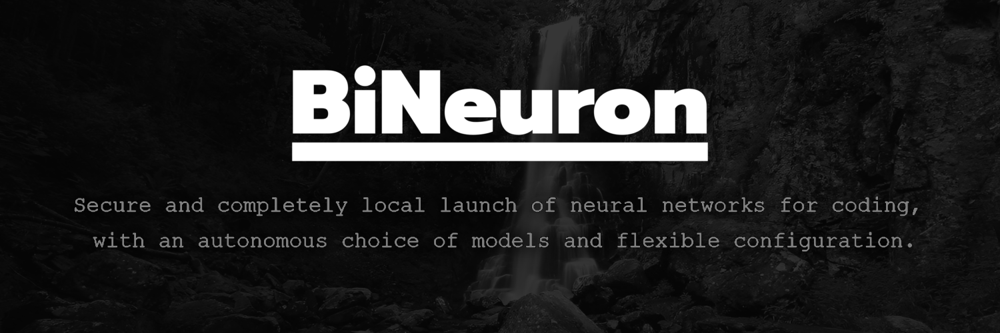

  
    

  

# BiNeuron  

🇬🇧 English

**Intelligent Code Analysis and Generation Platform**  

BiNeuron is a sophisticated software solution that bridges the gap between human intent and machine‑generated code. It unifies advanced natural language processing, optical character recognition, and adaptive model selection into a single, powerful tool designed for developers, researchers, and technical teams.  

At its core, BiNeuron automatically identifies the programming language of a given request, extracts content from a wide array of file formats—including images and documents—and then generates context‑aware, production‑ready code using best‑in‑class local or cloud‑based language models.

## Key Capabilities  

### Programming Language Detection  
- Supports over 25 programming languages, including Python, Java, C/C++, C#, JavaScript, TypeScript, Go, Rust, Swift, Kotlin, Ruby, Dart, Julia, Lua, SQL, MATLAB, R, Pascal, Assembly, Fortran, F#, Ada, Zig, PHP, Shell, Scala, and more.  
- Combines heuristic algorithms, proprietary keyword matching, and AI‑powered orchestration to achieve high detection accuracy.  
- Analyzes both user‑supplied text and the content of attached files, or even entire directories.  

### Comprehensive File Handling  
- Extracts and translates text from common document formats: PDF, Word (DOCX), ODF, and PowerPoint (PPTX).  
- Processes source code files in nearly all text‑based formats, from plain text to configuration files.  
- Integrates advanced OCR (DeepSeek OCR or EasyOCR) to read text from images, with optional GPU acceleration and automatic splitting of large images for improved recognition.  

### AI-Powered File Editing  
- **Two‑Stage Pipeline**: The primary AI model generates the code/response. A secondary, lightweight model (e.g., Qwen2.5-Coder-1.5B) then transforms the response into a strict JSON object containing absolute file paths and full new contents.  
- **Full Context Awareness**: The JSON formatter receives the complete file context (all read files, unread file names, project root, and the primary AI’s answer) to ensure accurate path generation and content mapping.  
- **Robust Retry Mechanism**: If the JSON fails validation, the system automatically re‑prompts the formatter up to `retries` times, logging each attempt until a valid JSON is produced or the maximum retries are exhausted.  
- **Safe, Whole‑File Replacements**: Only whole-file replacements are supported (no partial edits) to maintain consistency and safety. Deletion (`null`) is intentionally not implemented to prevent accidental data loss.

### Adaptive Model Selection  
- Automatically assesses the user’s hardware capabilities (CPU cores, frequency, RAM) and selects the optimal quantized version of the target model (ranging from IQ2 to F16) to balance speed and accuracy.  
- Offers a curated repository of specialised models per programming language, ensuring high‑quality, idiomatic code generation.  

### Robust Networking  
- Implements multi‑layered accessibility to Hugging Face models, including automatic fallback to hf‑mirror.com, dynamic proxy selection, and support for custom proxy lists.  
- Fetches and verifies public proxies from GitHub raw lists, with retry mechanisms and connection health checks.  

### Virtual Storage Mode  
- Allows scanning and processing of entire folders or mounted virtual directories.  
- Recursively identifies supported files, extracts their content, and incorporates it into the analysis context—perfect for large codebases or repositories.  
- **Interactive File Explorer**: In GUI mode, the virtual storage is displayed as a tree view. Double‑click any file to open it in the default system application.  

### Multilingual Translation  
- Built‑in translation engine normalises user requests to English (or any configured target language) to ensure consistent AI interactions.  
- Supports both Google Translate and DeepL, with automatic fallback when network restrictions are detected.  

## Architecture  

BiNeuron is engineered with a modular, separation‑of‑concerns design:  

- **Core Engine** – orchestrates the entire pipeline: request parsing, language detection, model selection, and response generation.  
- **OCR Module** – handles text extraction from images and scanned documents via DeepSeek OCR or EasyOCR.  
- **Model Downloader** – manages downloading and caching of Hugging Face models, with built‑in mirror and proxy support.  
- **JSON Formatter Module** – uses a lightweight model (e.g., Qwen2.5-Coder-1.5B) to convert the primary model’s response into a strict JSON object for file modifications.  
- **File Editing Module** – applies JSON‑based file changes (whole-file replacements) with error handling and retry logic.  
- **Translation Service** – provides language detection and translation utilities, with optional DeepL integration.  
- **Network Layer** – implements proxy rotation, availability checks, and GitHub proxy fetching for circumventing restrictions.  
- **User Interfaces** – a feature‑rich graphical interface built with CustomTkinter, and a comprehensive command‑line interface powered by Click.  

The architecture emphasises reusability, fault tolerance, and performance, allowing each component to operate independently while seamlessly integrating with the others.  

## Technology Stack  

- **Python 3.10+** – primary development language  
- **Hugging Face Transformers / llama.cpp** – for loading and running AI models locally  
- **EasyOCR, DeepSeek OCR** – optical character recognition  
- **deep‑translator, DeepL** – translation services  
- **PyMuPDF, docx2txt, python‑pptx, odfpy** – document parsing  
- **Tkinter** – modern, themeable GUI  
- **Click** – command‑line interface  
- **requests, httpx** – network communication  
- **psutil, multiprocessing** – system resource monitoring and benchmarking  
- **Qwen/Qwen2.5-Coder-1.5B-Instruct-GGUF** – lightweight JSON formatter for file editing

## Model Repository  

BiNeuron leverages a hand‑picked collection of open‑source code generation models, each fine‑tuned for specific programming languages. The repository includes models from DeepSeek, Qwen, MiniMax, CodeLlama, Mellum, and Wizard, among others. The system automatically fetches the appropriate model based on the detected language and the user’s hardware profile, ensuring optimal performance for every session.  

## User Interfaces  

### Graphical Interface  
A desktop application built with CustomTkinter, offering:  
- **Intuitive Chat Interface** – message history, file attachments, and real‑time log display.  
- **Virtual Storage Explorer** – scan and navigate directories in a tree view.  
- **Comprehensive Settings Panel** – fine‑tune every aspect of the platform: network, model selection, OCR, translation, and more.  
- **Chat Management** – create, delete, download, and filter conversation history.  
- **Live Logging** – see what the AI is doing in real time.  
- **Dark Theme** – optimized for long coding sessions.  

### Command‑Line Interface  
A Click‑based CLI that exposes the full functionality of BiNeuron through terminal arguments, making it suitable for automation, scripting, and integration into CI/CD pipelines.  

> BiNeuron represents a fusion of cutting‑edge AI, robust software engineering, and practical usability—empowering developers to focus on creativity and problem‑solving while the platform handles the complexities of language detection, file processing, and model orchestration.

🇷🇺 Русский

**Интеллектуальная платформа для анализа и генерации кода**  

BiNeuron ‑ это сложное программное решение, которое устраняет разрыв между намерениями человека и машинным кодом. Он объединяет продвинутую обработку естественного языка, оптическое распознавание символов и адаптивный выбор модели в единый мощный инструмент, предназначенный для разработчиков, исследователей и технических групп.  

По своей сути, BiNeuron автоматически определяет язык программирования для данного запроса, извлекает содержимое из широкого спектра форматов файлов, включая изображения и документы, а затем генерирует контекстно‑зависимый, готовый к работе код, используя лучшие в своем классе локальные или облачные языковые модели.

## Ключевые возможности  

### Определение языка программирования  
- Поддерживает более 25 языков программирования, включая Python, Java, C/C++, C#, JavaScript, TypeScript, Go, Rust, Swift, Kotlin, Ruby, Dart, Julia, Lua, SQL, MATLAB, R, Pascal, Assembly, Fortran, F#, Ada, Zig, PHP, Shell, Scala и другие.  
- Объединяет эвристические алгоритмы, фирменный поиск по ключевым словам и ИИ‑управляемую оркестрацию для высокой точности определения.  
- Анализирует как текст, введённый пользователем, так и содержимое прикреплённых файлов или даже целых каталогов.  

### Всесторонняя обработка файлов  
- Извлекает и преобразует текст из распространённых форматов документов: PDF, Word (DOCX), ODF и PowerPoint (PPTX).  
- Обрабатывает файлы исходного кода почти во всех текстовых форматах — от обычного текста до конфигурационных файлов.  
- Интегрирует продвинутое OCR (DeepSeek OCR или EasyOCR) для чтения текста из изображений, с опциональным ускорением на GPU и автоматическим разбиением больших изображений для улучшенного распознавания.  

### Изменение файлов с помощью ИИ  
- **Двухэтапный пайплайн**: Основная ИИ-модель генерирует код/ответ. Вторичная лёгкая модель (например, Qwen2.5-Coder-1.5B) преобразует этот ответ в строгий JSON-объект, содержащий абсолютные пути к файлам и новое полное содержимое.  
- **Полный контекст**: Форматтер JSON получает весь контекст файлов (все прочитанные файлы, имена непрочитанных файлов, корень проекта и ответ основной ИИ-модели) для точной генерации путей и содержимого.  
- **Надёжный механизм повторных попыток**: Если JSON не проходит валидацию, система автоматически перезапрашивает форматтер до `retries` раз, логируя каждую попытку, пока не будет получен валидный JSON или не будут исчерпаны все попытки.  
- **Безопасная замена целых файлов**: Поддерживается только полная замена файлов (не частичное редактирование) для обеспечения согласованности и безопасности. Удаление (`null`) намеренно не реализовано во избежание случайной потери данных.

### Адаптивный выбор модели  
- Автоматически оценивает аппаратные возможности пользователя (количество ядер CPU, частота, ОЗУ) и выбирает оптимальную квантизованную версию целевой модели (от IQ2 до F16) для баланса скорости и точности.  
- Предлагает специально подобранный репозиторий моделей для каждого языка программирования, обеспечивая высококачественную и идиоматичную генерацию кода.  

### Надёжные сетевые возможности  
- Реализует многоуровневый доступ к моделям Hugging Face, включая автоматическое переключение на hf‑mirror.com, динамический выбор прокси и поддержку пользовательских списков прокси.  
- Загружает и проверяет публичные прокси из списков GitHub, с повторными попытками и проверкой работоспособности соединений.  

### Режим виртуального хранилища  
- Позволяет сканировать и обрабатывать целые папки или смонтированные виртуальные директории.  
- Рекурсивно определяет поддерживаемые файлы, извлекает их содержимое и включает его в контекст анализа — идеально для больших кодовых баз или репозиториев.  
- **Интерактивный файловый менеджер**: В режиме GUI виртуальное хранилище отображается в виде дерева. Двойной клик по файлу открывает его в системном приложении по умолчанию.  

### Многоязычный перевод  
- Встроенный механизм перевода приводит запросы пользователя к английскому (или любому другому настроенному языку) для единообразного взаимодействия с ИИ.  
- Поддерживает Google Translate и DeepL с автоматическим переключением при обнаружении сетевых ограничений.  

## Архитектура  

BiNeuron спроектирован по модульному принципу с разделением ответственности:  

- **Основной движок** – управляет всем конвейером: разбор запроса, определение языка, выбор модели и генерация ответа.  
- **Модуль OCR** – обрабатывает извлечение текста из изображений и отсканированных документов через DeepSeek OCR или EasyOCR.  
- **Загрузчик моделей** – управляет загрузкой и кэшированием моделей Hugging Face со встроенной поддержкой зеркал и прокси.  
- **Модуль JSON-форматтера** – использует лёгкую модель (например, Qwen2.5-Coder-1.5B) для преобразования ответа основной модели в строгий JSON для изменения файлов.  
- **Модуль редактирования файлов** – применяет изменения на основе JSON (полная замена файлов) с обработкой ошибок и повторными попытками.  
- **Сервис перевода** – предоставляет функции определения языка и перевода, с опциональной интеграцией DeepL.  
- **Сетевой уровень** – реализует ротацию прокси, проверку доступности и получение прокси из GitHub для обхода ограничений.  
- **Пользовательские интерфейсы** – насыщенный графический интерфейс на CustomTkinter и полнофункциональный интерфейс командной строки на Click.  

Архитектура делает упор на переиспользуемость, отказоустойчивость и производительность, позволяя каждому компоненту работать независимо, но при этом бесшовно интегрироваться с другими.  

## Технологический стек  

- **Python 3.10+** – основной язык разработки  
- **Hugging Face Transformers / llama.cpp** – для локальной загрузки и запуска ИИ‑моделей  
- **EasyOCR, DeepSeek OCR** – оптическое распознавание символов  
- **deep‑translator, DeepL** – сервисы перевода  
- **PyMuPDF, docx2txt, python‑pptx, odfpy** – парсинг документов  
- **Tkinter** – современный, настраиваемый GUI  
- **Click** – интерфейс командной строки  
- **requests, httpx** – сетевое взаимодействие  
- **psutil, multiprocessing** – мониторинг системных ресурсов и бенчмаркинг  
- **Qwen/Qwen2.5-Coder-1.5B-Instruct-GGUF** – лёгкий форматтер JSON для редактирования файлов

## Репозиторий моделей  

BiNeuron использует тщательно подобранную коллекцию открытых моделей генерации кода, каждая из которых дообучена для конкретных языков программирования. В репозиторий входят модели от DeepSeek, Qwen, MiniMax, CodeLlama, Mellum, Wizard и других. Система автоматически загружает подходящую модель на основе определённого языка и аппаратного профиля пользователя, обеспечивая оптимальную производительность в каждом сеансе.  

## Пользовательские интерфейсы  

### Графический интерфейс  
Десктопное приложение на CustomTkinter, предлагающее:  
- **Интуитивный чат** – история сообщений, прикрепление файлов и отображение логов в реальном времени.  
- **Обозреватель виртуального хранилища** – сканирование и навигация по директориям в виде дерева.  
- **Всеобъемлющая панель настроек** – тонкая настройка каждого аспекта платформы: сеть, выбор модели, OCR, перевод и многое другое.  
- **Управление чатами** – создание, удаление, загрузка и фильтрация истории диалогов.  
- **Live‑логи** – просмотр действий ИИ в реальном времени.  
- **Тёмная тема** – оптимизирована для длительных сессий разработки.  

### Интерфейс командной строки  
CLI на базе Click, открывающий всю функциональность BiNeuron через аргументы терминала, что делает его пригодным для автоматизации, скриптов и интеграции в CI/CD пайплайны.  

> BiNeuron представляет собой синтез передового ИИ, надёжной инженерии и практической полезности, позволяя разработчикам сосредоточиться на творчестве и решении задач, пока платформа берёт на себя сложности определения языка, обработки файлов и оркестрации моделей.

