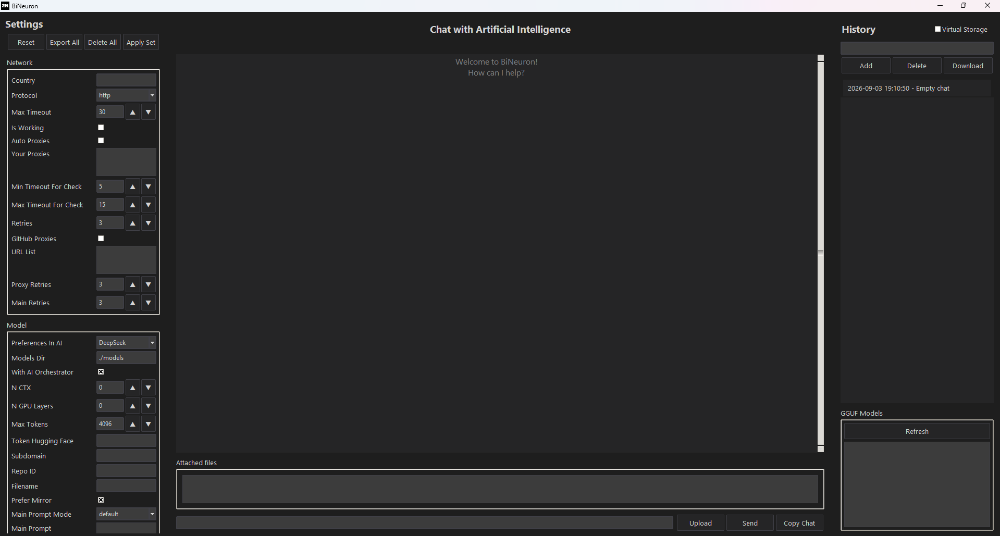

  
    

  

# BiNeuron  

🇬🇧 English

**Intelligent Code Analysis and Generation Platform**  

BiNeuron is a sophisticated software solution that bridges the gap between human intent and machine‑generated code. It unifies advanced natural language processing, optical character recognition, and adaptive model selection into a single, powerful tool designed for developers, researchers, and technical teams.  

At its core, BiNeuron automatically identifies the programming language of a given request, extracts content from a wide array of file formats—including images and documents—and then generates context‑aware, production‑ready code using best‑in‑class local or cloud‑based language models.

## Key Capabilities  

### Programming Language Detection  
- Supports over 25 programming languages, including Python, Java, C/C++, C#, JavaScript, TypeScript, Go, Rust, Swift, Kotlin, Ruby, Dart, Julia, Lua, SQL, MATLAB, R, Pascal, Assembly, Fortran, F#, Ada, Zig, PHP, Shell, Scala, and more.  
- Combines heuristic algorithms, proprietary keyword matching, and AI‑powered orchestration to achieve high detection accuracy.  
- Analyzes both user‑supplied text and the content of attached files, or even entire directories.  

### Comprehensive File Handling  
- Extracts and translates text from common document formats: PDF, Word (DOCX), ODF, and PowerPoint (PPTX).  
- Processes source code files in nearly all text‑based formats, from plain text to configuration files.  
- Integrates advanced OCR (DeepSeek OCR or EasyOCR) to read text from images, with optional GPU acceleration and automatic splitting of large images for improved recognition.  

### AI-Powered File Editing  
- **Two‑Stage Pipeline**: The primary AI model generates the code/response. A secondary, lightweight model (e.g., Qwen2.5-Coder-1.5B) then transforms the response into a strict JSON object containing absolute file paths and full new contents.  
- **Full Context Awareness**: The JSON formatter receives the complete file context (all read files, unread file names, project root, and the primary AI’s answer) to ensure accurate path generation and content mapping.  
- **Robust Retry Mechanism**: If the JSON fails validation, the system automatically re‑prompts the formatter up to `retries` times, logging each attempt until a valid JSON is produced or the maximum retries are exhausted.  
- **Safe, Whole‑File Replacements**: Only whole-file replacements are supported (no partial edits) to maintain consistency and safety. Deletion (`null`) is intentionally not implemented to prevent accidental data loss.

### Adaptive Model Selection  
- Automatically assesses the user’s hardware capabilities (CPU cores, frequency, RAM) and selects the optimal quantized version of the target model (ranging from IQ2 to F16) to balance speed and accuracy.  
- Offers a curated repository of specialised models per programming language, ensuring high‑quality, idiomatic code generation.  

### Robust Networking  
- Implements multi‑layered accessibility to Hugging Face models, including automatic fallback to hf‑mirror.com, dynamic proxy selection, and support for custom proxy lists.  
- Fetches and verifies public proxies from GitHub raw lists, with retry mechanisms and connection health checks.  

### Virtual Storage Mode  
- Allows scanning and processing of entire folders or mounted virtual directories.  
- Recursively identifies supported files, extracts their content, and incorporates it into the analysis context—perfect for large codebases or repositories.  
- **Interactive File Explorer**: In GUI mode, the virtual storage is displayed as a tree view. Double‑click any file to open it in the default system application.  

### Multilingual Translation  
- Built‑in translation engine normalises user requests to English (or any configured target language) to ensure consistent AI interactions.  
- Supports both Google Translate and DeepL, with automatic fallback when network restrictions are detected.  

## Architecture  

BiNeuron is engineered with a modular, separation‑of‑concerns design:  

- **Core Engine** – orchestrates the entire pipeline: request parsing, language detection, model selection, and response generation.  
- **OCR Module** – handles text extraction from images and scanned documents via DeepSeek OCR or EasyOCR.  
- **Model Downloader** – manages downloading and caching of Hugging Face models, with built‑in mirror and proxy support.  
- **JSON Formatter Module** – uses a lightweight model (e.g., Qwen2.5-Coder-1.5B) to convert the primary model’s response into a strict JSON object for file modifications.  
- **File Editing Module** – applies JSON‑based file changes (whole-file replacements) with error handling and retry logic.  
- **Translation Service** – provides language detection and translation utilities, with optional DeepL integration.  
- **Network Layer** – implements proxy rotation, availability checks, and GitHub proxy fetching for circumventing restrictions.  
- **Graphical User Interface** – a feature‑rich desktop application built with Tkinter for seamless interaction.  

The architecture emphasises reusability, fault tolerance, and performance, allowing each component to operate independently while seamlessly integrating with the others.  

## Graphical Interface  

  

A desktop application built with Tkinter, offering:  
- **Intuitive Chat Interface** – message history, file attachments, and real‑time log display.  
- **Virtual Storage Explorer** – scan and navigate directories in a tree view.  
- **Comprehensive Settings Panel** – fine‑tune every aspect of the platform: network, model selection, OCR, translation, and more.  
- **Chat Management** – create, delete, download, and filter conversation history.  
- **Live Logging** – see what the AI is doing in real time.  
- **Dark Theme** – optimized for long coding sessions.  

The application is designed to be user‑friendly, allowing developers to focus on coding while the AI handles the heavy lifting of language detection, file processing, and model orchestration.

## Technology Stack  

- **Python 3.10+** – primary development language  
- **Hugging Face Transformers / llama.cpp** – for loading and running AI models locally  
- **EasyOCR, DeepSeek OCR** – optical character recognition  
- **deep‑translator, DeepL** – translation services  
- **PyMuPDF, docx2txt, python‑pptx, odfpy** – document parsing  
- **Tkinter** – modern, themeable graphical interface  
- **requests, httpx** – network communication  
- **psutil, multiprocessing** – system resource monitoring and benchmarking  
- **Qwen/Qwen2.5-Coder-1.5B-Instruct-GGUF** – lightweight JSON formatter for file editing

## Model Repository  

BiNeuron leverages a hand‑picked collection of open‑source code generation models, each fine‑tuned for specific programming languages. The repository includes models from DeepSeek, Qwen, MiniMax, CodeLlama, Mellum, and Wizard, among others. The system automatically fetches the appropriate model based on the detected language and the user’s hardware profile, ensuring optimal performance for every session.  

> BiNeuron represents a fusion of cutting‑edge AI, robust software engineering, and practical usability—empowering developers to focus on creativity and problem‑solving while the platform handles the complexities of language detection, file processing, and model orchestration.

🇷🇺 Русский

**Интеллектуальная платформа для анализа и генерации кода**  

BiNeuron ‑ это сложное программное решение, которое устраняет разрыв между намерениями человека и машинным кодом. Он объединяет продвинутую обработку естественного языка, оптическое распознавание символов и адаптивный выбор модели в единый мощный инструмент, предназначенный для разработчиков, исследователей и технических групп.  

По своей сути, BiNeuron автоматически определяет язык программирования для данного запроса, извлекает содержимое из широкого спектра форматов файлов, включая изображения и документы, а затем генерирует контекстно‑зависимый, готовый к работе код, используя лучшие в своем классе локальные или облачные языковые модели.

## Ключевые возможности  

### Определение языка программирования  
- Поддерживает более 25 языков программирования, включая Python, Java, C/C++, C#, JavaScript, TypeScript, Go, Rust, Swift, Kotlin, Ruby, Dart, Julia, Lua, SQL, MATLAB, R, Pascal, Assembly, Fortran, F#, Ada, Zig, PHP, Shell, Scala и другие.  
- Объединяет эвристические алгоритмы, фирменный поиск по ключевым словам и ИИ‑управляемую оркестрацию для высокой точности определения.  
- Анализирует как текст, введённый пользователем, так и содержимое прикреплённых файлов или даже целых каталогов.  

### Всесторонняя обработка файлов  
- Извлекает и преобразует текст из распространённых форматов документов: PDF, Word (DOCX), ODF и PowerPoint (PPTX).  
- Обрабатывает файлы исходного кода почти во всех текстовых форматах — от обычного текста до конфигурационных файлов.  
- Интегрирует продвинутое OCR (DeepSeek OCR или EasyOCR) для чтения текста из изображений, с опциональным ускорением на GPU и автоматическим разбиением больших изображений для улучшенного распознавания.  

### Изменение файлов с помощью ИИ  
- **Двухэтапный пайплайн**: Основная ИИ-модель генерирует код/ответ. Вторичная лёгкая модель (например, Qwen2.5-Coder-1.5B) преобразует этот ответ в строгий JSON-объект, содержащий абсолютные пути к файлам и новое полное содержимое.  
- **Полный контекст**: Форматтер JSON получает весь контекст файлов (все прочитанные файлы, имена непрочитанных файлов, корень проекта и ответ основной ИИ-модели) для точной генерации путей и содержимого.  
- **Надёжный механизм повторных попыток**: Если JSON не проходит валидацию, система автоматически перезапрашивает форматтер до `retries` раз, логируя каждую попытку, пока не будет получен валидный JSON или не будут исчерпаны все попытки.  
- **Безопасная замена целых файлов**: Поддерживается только полная замена файлов (не частичное редактирование) для обеспечения согласованности и безопасности. Удаление (`null`) намеренно не реализовано во избежание случайной потери данных.

### Адаптивный выбор модели  
- Автоматически оценивает аппаратные возможности пользователя (количество ядер CPU, частота, ОЗУ) и выбирает оптимальную квантизованную версию целевой модели (от IQ2 до F16) для баланса скорости и точности.  
- Предлагает специально подобранный репозиторий моделей для каждого языка программирования, обеспечивая высококачественную и идиоматичную генерацию кода.  

### Надёжные сетевые возможности  
- Реализует многоуровневый доступ к моделям Hugging Face, включая автоматическое переключение на hf‑mirror.com, динамический выбор прокси и поддержку пользовательских списков прокси.  
- Загружает и проверяет публичные прокси из списков GitHub, с повторными попытками и проверкой работоспособности соединений.  

### Режим виртуального хранилища  
- Позволяет сканировать и обрабатывать целые папки или смонтированные виртуальные директории.  
- Рекурсивно определяет поддерживаемые файлы, извлекает их содержимое и включает его в контекст анализа — идеально для больших кодовых баз или репозиториев.  
- **Интерактивный файловый менеджер**: В режиме GUI виртуальное хранилище отображается в виде дерева. Двойной клик по файлу открывает его в системном приложении по умолчанию.  

### Многоязычный перевод  
- Встроенный механизм перевода приводит запросы пользователя к английскому (или любому другому настроенному языку) для единообразного взаимодействия с ИИ.  
- Поддерживает Google Translate и DeepL с автоматическим переключением при обнаружении сетевых ограничений.  

## Графический интерфейс  

  

Десктопное приложение на Tkinter, предлагающее:  
- **Интуитивный чат** – история сообщений, прикрепление файлов и отображение логов в реальном времени.  
- **Обозреватель виртуального хранилища** – сканирование и навигация по директориям в виде дерева.  
- **Всеобъемлющая панель настроек** – тонкая настройка каждого аспекта платформы: сеть, выбор модели, OCR, перевод и многое другое.  
- **Управление чатами** – создание, удаление, загрузка и фильтрация истории диалогов.  
- **Live‑логи** – просмотр действий ИИ в реальном времени.  
- **Тёмная тема** – оптимизирована для длительных сессий разработки.  

Приложение разработано с упором на удобство, позволяя разработчикам сосредоточиться на коде, пока ИИ берёт на себя сложности определения языка, обработки файлов и оркестрации моделей.

## Архитектура  

BiNeuron спроектирован по модульному принципу с разделением ответственности:  

- **Основной движок** – управляет всем конвейером: разбор запроса, определение языка, выбор модели и генерация ответа.  
- **Модуль OCR** – обрабатывает извлечение текста из изображений и отсканированных документов через DeepSeek OCR или EasyOCR.  
- **Загрузчик моделей** – управляет загрузкой и кэшированием моделей Hugging Face со встроенной поддержкой зеркал и прокси.  
- **Модуль JSON-форматтера** – использует лёгкую модель (например, Qwen2.5-Coder-1.5B) для преобразования ответа основной модели в строгий JSON для изменения файлов.  
- **Модуль редактирования файлов** – применяет изменения на основе JSON (полная замена файлов) с обработкой ошибок и повторными попытками.  
- **Сервис перевода** – предоставляет функции определения языка и перевода, с опциональной интеграцией DeepL.  
- **Сетевой уровень** – реализует ротацию прокси, проверку доступности и получение прокси из GitHub для обхода ограничений.  
- **Графический интерфейс** – насыщенное десктопное приложение на Tkinter для удобного взаимодействия.  

Архитектура делает упор на переиспользуемость, отказоустойчивость и производительность, позволяя каждому компоненту работать независимо, но при этом бесшовно интегрироваться с другими.  

## Технологический стек  

- **Python 3.10+** – основной язык разработки  
- **Hugging Face Transformers / llama.cpp** – для локальной загрузки и запуска ИИ‑моделей  
- **EasyOCR, DeepSeek OCR** – оптическое распознавание символов  
- **deep‑translator, DeepL** – сервисы перевода  
- **PyMuPDF, docx2txt, python‑pptx, odfpy** – парсинг документов  
- **Tkinter** – современный, настраиваемый графический интерфейс  
- **requests, httpx** – сетевое взаимодействие  
- **psutil, multiprocessing** – мониторинг системных ресурсов и бенчмаркинг  
- **Qwen/Qwen2.5-Coder-1.5B-Instruct-GGUF** – лёгкий форматтер JSON для редактирования файлов

## Репозиторий моделей  

BiNeuron использует тщательно подобранную коллекцию открытых моделей генерации кода, каждая из которых дообучена для конкретных языков программирования. В репозиторий входят модели от DeepSeek, Qwen, MiniMax, CodeLlama, Mellum, Wizard и других. Система автоматически загружает подходящую модель на основе определённого языка и аппаратного профиля пользователя, обеспечивая оптимальную производительность в каждом сеансе.  

> BiNeuron представляет собой синтез передового ИИ, надёжной инженерии и практической полезности, позволяя разработчикам сосредоточиться на творчестве и решении задач, пока платформа берёт на себя сложности определения языка, обработки файлов и оркестрации моделей.

🇨🇳 中文

**智能代码分析与生成平台**  

BiNeuron 是一个先进的软件解决方案，旨在弥合人类意图与机器生成代码之间的鸿沟。它将先进的自然语言处理、光学字符识别和自适应模型选择整合到一个功能强大的工具中，专为开发者、研究人员和技术团队设计。  

其核心功能是自动识别给定请求的编程语言，从包括图像和文档在内的多种文件格式中提取内容，然后使用一流本地或云端语言模型生成上下文感知、可用于生产的代码。

## 主要功能  

### 编程语言检测  
- 支持超过 25 种编程语言，包括 Python、Java、C/C++、C#、JavaScript、TypeScript、Go、Rust、Swift、Kotlin、Ruby、Dart、Julia、Lua、SQL、MATLAB、R、Pascal、Assembly、Fortran、F#、Ada、Zig、PHP、Shell、Scala 等。  
- 结合启发式算法、专有关键词匹配和 AI 驱动的编排，实现高检测精度。  
- 分析用户提供的文本以及附加文件内容，甚至整个目录。  

### 全面的文件处理  
- 从常见文档格式中提取和转换文本：PDF、Word（DOCX）、ODF 和 PowerPoint（PPTX）。  
- 处理几乎所有基于文本格式的源代码文件，从纯文本到配置文件。  
- 集成先进的 OCR（DeepSeek OCR 或 EasyOCR）从图像中读取文本，支持可选的 GPU 加速，并可自动分割大图像以提高识别效果。  

### AI 驱动的文件编辑  
- **两阶段流水线**：主 AI 模型生成代码/响应。随后，一个轻量级辅助模型（例如 Qwen2.5-Coder-1.5B）将该响应转换为严格的 JSON 对象，其中包含绝对文件路径和完整的新内容。  
- **完整上下文感知**：JSON 格式化器接收完整的文件上下文（所有已读文件、未读文件名、项目根目录以及主 AI 的回答），以确保准确的路径生成和内容映射。  
- **强大的重试机制**：如果 JSON 验证失败，系统会自动重新提示格式化器，最多重试 `retries` 次，并记录每次尝试，直到生成有效 JSON 或达到最大重试次数。  
- **安全的整文件替换**：仅支持整文件替换（不支持部分编辑），以保持一致性和安全性。故意不实现删除（`null`）功能，以防止意外数据丢失。

### 自适应模型选择  
- 自动评估用户的硬件能力（CPU 核心数、频率、RAM），并选择目标模型的最佳量化版本（从 IQ2 到 F16），以平衡速度和精度。  
- 为每种编程语言提供精选的专用模型仓库，确保生成高质量、地道的代码。  

### 强大的网络功能  
- 实现对 Hugging Face 模型的多层访问，包括自动回退到 hf‑mirror.com、动态代理选择以及自定义代理列表支持。  
- 从 GitHub 原始列表中获取并验证公共代理，具有重试机制和连接健康检查。  

### 虚拟存储模式  
- 允许扫描和处理整个文件夹或挂载的虚拟目录。  
- 递归识别支持的文件，提取其内容并将其纳入分析上下文——非常适合大型代码库或仓库。  
- **交互式文件浏览器**：在 GUI 模式下，虚拟存储以树形视图显示。双击任何文件可在默认系统应用程序中打开。  

### 多语言翻译  
- 内置翻译引擎将用户请求标准化为英语（或任何配置的目标语言），以确保一致的 AI 交互。  
- 支持 Google Translate 和 DeepL，检测到网络限制时自动回退。  

## 架构  

BiNeuron 采用模块化、关注点分离的设计：  

- **核心引擎** – 编排整个流水线：请求解析、语言检测、模型选择和响应生成。  
- **OCR 模块** – 通过 DeepSeek OCR 或 EasyOCR 处理图像和扫描文档中的文本提取。  
- **模型下载器** – 管理 Hugging Face 模型的下载和缓存，内置镜像和代理支持。  
- **JSON 格式化器模块** – 使用轻量级模型（例如 Qwen2.5-Coder-1.5B）将主模型的响应转换为严格的 JSON 对象以用于文件修改。  
- **文件编辑模块** – 应用基于 JSON 的文件更改（整文件替换），具备错误处理和重试逻辑。  
- **翻译服务** – 提供语言检测和翻译工具，可选集成 DeepL。  
- **网络层** – 实现代理轮换、可用性检查以及从 GitHub 获取代理以规避限制。  
- **图形用户界面** – 使用 Tkinter 构建的功能丰富的桌面应用程序，实现无缝交互。  

该架构强调可重用性、容错性和性能，允许每个组件独立运行，同时与其他组件无缝集成。  

## 图形界面  

  

使用 Tkinter 构建的桌面应用程序，提供：  
- **直观的聊天界面** – 消息历史、文件附件和实时日志显示。  
- **虚拟存储浏览器** – 以树形视图扫描和导航目录。  
- **全面的设置面板** – 微调平台的每个方面：网络、模型选择、OCR、翻译等。  
- **聊天管理** – 创建、删除、下载和筛选对话历史。  
- **实时日志** – 实时查看 AI 的操作。  
- **深色主题** – 针对长时间编码会话进行优化。  

该应用程序设计为易于使用，使开发人员可以专注于编码，而 AI 处理语言检测、文件处理和模型编排的繁重工作。

## 技术栈  

- **Python 3.10+** – 主要开发语言  
- **Hugging Face Transformers / llama.cpp** – 用于本地加载和运行 AI 模型  
- **EasyOCR, DeepSeek OCR** – 光学字符识别  
- **deep‑translator, DeepL** – 翻译服务  
- **PyMuPDF, docx2txt, python‑pptx, odfpy** – 文档解析  
- **Tkinter** – 现代化、可定制主题的图形界面  
- **requests, httpx** – 网络通信  
- **psutil, multiprocessing** – 系统资源监控和基准测试  
- **Qwen/Qwen2.5-Coder-1.5B-Instruct-GGUF** – 用于文件编辑的轻量级 JSON 格式化器

## 模型仓库  

BiNeuron 利用精心挑选的开源代码生成模型集合，每个模型针对特定编程语言进行了微调。仓库包含来自 DeepSeek、Qwen、MiniMax、CodeLlama、Mellum 和 Wizard 等的模型。系统根据检测到的语言和用户的硬件配置自动获取合适的模型，确保每次会话都能获得最佳性能。  

> BiNeuron 融合了前沿 AI、稳健软件工程和实用性，使开发人员能够专注于创造力和解决问题，而平台则处理语言检测、文件处理和模型编排的复杂性。

